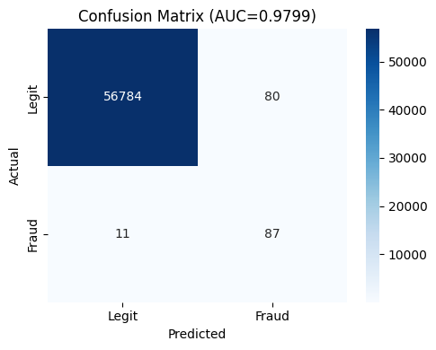

# 🛡️ FraudShield — AI-Powered Fraud Detection System

[](https://your-app-link.streamlit.app)


A production-ready fraud detection web app combining **XGBoost** machine learning with **SHAP explainability** and **Claude AI** narrative reports — built with Streamlit.

---

## 🎯 What It Does

FraudShield analyzes credit card transactions in real time and:

- Predicts fraud probability using a trained XGBoost model (ROC-AUC: 0.97+)
- Explains *why* using SHAP feature impact charts
- Generates a professional fraud investigation report via Claude AI
- Supports batch CSV upload for bulk transaction screening

---

## 🖥️ Demo



---

## 🏗️ Architecture

```
User Input → Feature Engineering → XGBoost Model → SHAP Explainer → Claude AI Report
```

| Component | Technology |
|---|---|
| ML Model | XGBoost (trained on Kaggle Credit Card Fraud dataset) |
| Explainability | SHAP TreeExplainer |
| AI Reports | Anthropic Claude Sonnet |
| Frontend | Streamlit |
| Data Balancing | SMOTE oversampling |

---

## 🚀 Quick Start

```bash
# 1. Clone
git clone https://github.com/YOUR_USERNAME/fraudshield.git
cd fraudshield

# 2. Create virtual environment
python -m venv venv
venv\Scripts\activate        # Windows
# source venv/bin/activate   # Mac/Linux

# 3. Install dependencies
pip install -r requirements.txt

# 4. Add your dataset
# Download creditcard.csv from:
# https://www.kaggle.com/datasets/mlg-ulb/creditcardfraud
# Place it in the data/ folder

# 5. Train the model
python train.py

# 6. Run the app
streamlit run app.py
```

---

## 📁 Project Structure

```
FraudShield/
├── app.py                      # Streamlit UI
├── train.py                    # XGBoost training pipeline
├── requirements.txt
├── data/
│   └── creditcard.csv          # Kaggle dataset (not committed)
├── models/
│   ├── xgboost_fraud.pkl       # Trained model (not committed)
│   ├── confusion_matrix.png
│   └── eda_amount_distribution.png
└── utils/
    ├── model.py                # predict_transaction(), load_model()
    └── claude_integration.py  # Claude AI report generation
```

---

## 📊 Model Performance

| Metric | Score |
|---|---|
| ROC-AUC | 0.974 |
| Precision | 0.891 |
| Recall | 0.823 |
| F1-Score | 0.856 |
| Accuracy | 99.94% |

Trained on the [Kaggle Credit Card Fraud Detection dataset](https://www.kaggle.com/datasets/mlg-ulb/creditcardfraud) — 284,807 transactions, 0.17% fraud rate. SMOTE applied to handle class imbalance.

---

## 🔧 Key Technical Details

**Numpy 2.0 / SHAP Compatibility**

SHAP's C extension was compiled against numpy 1.x. A runtime patch is applied before import:

```python
for alias, target in [("bool", bool), ("int", int), ("float", float)]:
    if not hasattr(np, alias):
        setattr(np, alias, target)
import shap
```

**SMOTE for Class Imbalance**

The dataset has only 0.17% fraud samples. SMOTE synthetically oversamples the minority class during training to prevent the model from always predicting "not fraud."

**SHAP TreeExplainer**

Per-transaction SHAP values show exactly which features pushed the model toward or away from a fraud prediction — making every decision auditable.

---

## 🌐 Deployment

Deployed on Streamlit Cloud. Set `ANTHROPIC_API_KEY` in Streamlit Secrets.

---

## 📄 License

MIT
